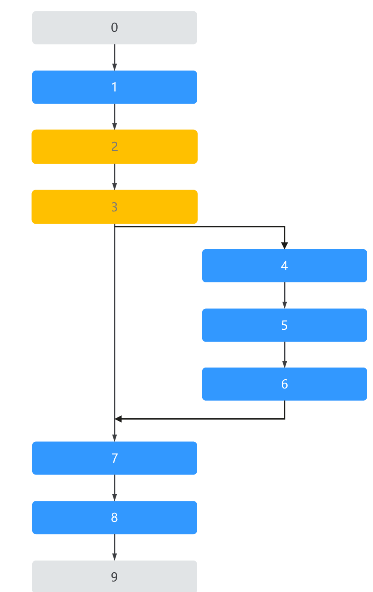

# 流程图

## 概念介绍

### 图的组成

ModelBox中，使用图来表达程序的执行逻辑。完整的图由节点和边组成，其中节点细分为三类：输入端口、输出端口、功能节点。

* 节点：
  * 输入端口：可选，可用于从图外发送输入数据，是图的起始，可以存在多个输入端口，需要保证多个输入端口传入的数据数量是一致的。

  * 输出端口：可选，可用于在图外接受输出输出，是图的结尾，可以存在多个输出端口，需要保证多个输出端口数据是可以匹配的。

  * 功能节点：必选，构成图功能的节点，和流程图类似，每个功能节点表示程序的操作步骤，每个步骤负责处理传入的数据处理并产生输出数据。节点可以定义多个输入端口和输出端口，节点从输入的多个端口中同时获取数据，结果再发送到多个输出端口中。处理时，节点需要关心输入所在的设备以及构建输出时使用的设备。

* 边：边是有向的，描述了节点之间数据传递的关系。边从前一个节点的输出端口，连接到下一个节点的输入端口。数据从输出端口发出后，由下一个节点输入端口的缓存队列保存数据，数据中包含多条数据流，每个数据流包含多个Buffer，例如视频场景下一个端口接收多个视频，每个视频存在多帧数据。

### 图的驱动

ModelBox的图中节点执行是由数据驱动的，即单个节点的输入端口数据准备完毕后，便会调用节点的处理函数进行数据处理，并将输出放入到后续节点的输入队列中。

### 数据准备

节点在输入端口数据准备就绪后，会进入执行。其中准备动作，包含了数据流划分、数据流匹配、按批划分、转移到目标设备等动作。

* 数据流划分
    前面提到单个端口的输入队列中包含多个数据流，所以首先对接收到的Buffer按照从属的流进行划分。
* 数据流匹配
    多个端口之间，流与流存在关联关系，如两个不同输入端口的流曾来自同一个节点的输出，那么这两个端口的流是存在匹配关系的，对于单次数据处理时，这两个端口的两个匹配数据流将会各取一个Buffer用来处理。因此节点的多端口输入数据流的Buffer数量要一致，否则会出现匹配失败。
* 按批划分
    对于支持批处理的节点，可以将匹配好的数据Batch切分，使得一次节点的处理函数调用传入Batch大小的数据进行处理。
* 转移到目标设备
    每个节点无需关心输入数据的来源，只需表明输入端口需要处理的数据应当存放的设备(默认与节点依赖设备一致)，对于不同来源的数据，会由框架进行数据搬移，保证输入的设备正确。

### 节点与功能单元

节点的实现在ModelBox中称为功能单元，一个功能单元是可以作为图中多个节点来使用，每个节点包含各自的功能单元实例，数据处理时，节点将准备好的数据传入功能单元处理。功能单元的介绍详见[功能单元](flowunit.md)

## 图的连接

在ModelBox图中，数据流从单个节点开始或从输入端口开始。

* 单个节点作为开始  
作为开始的节点只能有一个，当前节点作为数据的输入源，如http场景下，第一个节点监听http请求，并将请求作为一路流向后发送处理。
* 多个输入端口作为开始  
主要用于自定义应用模式下，数据从图的外部传入，可以将图的外部看作单个起始节点，多个输入端口可以看作这个节点的输出。

流程控制与程序流程图不同的是，暂不支持循环

* 普通连接：  
数据从当前节点输出，直接送入后续的节点输入。一个端口的输出可以给多个输入端口，一个输入端口只能接受一个输出端口的数据。
* 条件连接：  
需要设置当前节点作为条件节点，对于条件节点，每个输出端口为一个条件分支，一次处理中，所有分支只能有一个分支可以产生结果。例如条件节点输入一个数据流，奇数序号走A端口，偶数走B端口，经过条件节点后，完整的输入数据流被切分为了两个数据流。
对于条件数据流的多端口输出，在后续是可以重新合并回一个完整的数据流，需要将多个分支的数据流，连接到合并节点的同一个输入端口上，且只有条件流的合并才能做到多个输出端口连接到一个输入端口上。

数据流结尾可以是多个节点或者输出端口。

* 多个节点作为结束  
数据从前向后，到达最后一个节点，此节点可以将处理的结果传递到图外，如http场景下，最后一个节点将处理结果返回给发送请求的客户端。
* 多个输出端口作为结束  
主要用于自定义应用模式下，数据需要传递到图的外部，可以将图的外部看作单个结束节点，多个输出端口可以看作这个节点的输入，因此数据默认是需要匹配的，也可以通过配置说明多个端口的数据流不需要匹配。

## 图的执行及优先级

图是由数据驱动执行，多个节点可能同时存在数据需要执行，因此，节点需要确定执行的优先级，保证重要的节点先执行。节点的优先级是通过其拓扑结构来确定，越靠近结束的节点优先级越高，一是为了保证数据数据尽快完成，再是防止靠近入口的节点堆积过多数据。有了优先级后，调度器就能够从可执行的节点中挑选高优先级的节点去执行。

节点的优先级如下图所示：  

当某个节点被调度后，其状态会置为执行中，此时后续的数据会在输入队列中等待，直到本次执行完成后，才可以被继续调度执行，因此同一时刻，一个节点只会处理一批输入数据。在一批数据的处理中，会根据数据的关联性，决定这批数据执行的并发策略，尽量快速的处理当前批的数据。
