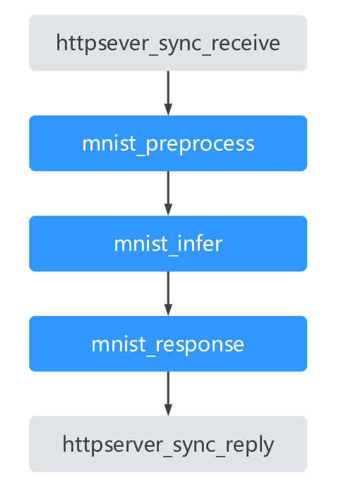

# 第一个应用

## 环境准备

环境准备可以使用现成ModleBox镜像，也可以从源代码构建ModelBox。本章节使用现成ModelBox镜像开发，如果没有相关的镜像，可以参考[编译安装](../../compile/compile.md)

### Docker开发镜像

1. 安装启动docker后，执行下列命令下载docker镜像

    ```shell
    docker pull modelbox/modelbox-develop-tensorflow_2.6.0-cuda_11.2-openeuler-x86_64
    ```

1. 配置并启动容器

    可采用一键式脚本快速进入容器。参考[一键式脚本](../../faq/container-usage.md)相关内容。

1. 进入容器并且切换至ModelBox开发者模式

   注意事项：
    * 如果需要通过可视化UI进行图的编排，可参考[可视化编排服务](../../server/editor.md)章节访问`http://[host]:[EDITOR_MAP_PORT]/editor/`地址；
    * 如果访问被拒绝，可参考[运行编排服务](../../server/editor.md)中的[访问控制列表](../../server/editor.md#访问控制列表)相关内容

## 第一个应用开发-mnist识别

开发环境准备好了之后进入应用开发环节，这里以MNIST为例介绍整个应用开发过程。首先介绍MNIST应用实现的功能，然后介绍流程图编排、功能单元编写、运行与调试3个开发步骤。

MNIST案例是使用MNIST数据集，训练的一个手写数字识别tensorflow模型，搭建的一个简易的http请求服务。模型训练可参考[tensorflow教程](https://doc.codingdict.com/tensorflow/tfdoc/tutorials/mnist_beginners.html) 。

### 功能

将MNIST数据，通过base格式发送到ModelBox推理，并获取结果。

流程上：ModelBox Server监听端口接收http请求，然后从请求体中的base64解析出图片，接着用训练出的MNIST模型进行推理，最后将识别出的数字返回给用户。

Request 请求样例：

``` json
{
    "image_base64": "xxxxx"
}
```

Response 响应样例：

``` json
{
    "predict_reuslt": "x"
}
```

### 模型准备

AI应用开发前需要准备好匹配当前modelbox版本支持的推理框架和版本的模型文件，这里默认已经准备好了tensorflow1.13版本的minist pb模型文件，路径如下：`/opt/modelbox/solution/model/mnist_model.pb`

### 流程图开发

流程图编排是根据实际情况将现有业务逻辑拆分为N个功能单元，再将功能单元串联成一个完整的业务的过程。功能单元分为ModelBox预置功能单元和用户自定义功能单元，当预置功能单元满足不了业务场景时，需要用户进行功能单元开发。有两种方式可编排流程图，第一种是使用UI进行可视化UI编排，第二种是直接编写图文件。具体可参考[流程图开发章节](../flow/flow.md#流程图开发及运行)。这里采用第二种方式。



如上图所示，根据业务流程可以将业务划分为5个功能单元，分别为接收http请求，MNIST预处理，MNIST模型推理，MNIST响应构造，发送http响应。对应图编排文件描述如下

``` toml
[graph]
format = "graphviz"
graphconf = '''digraph mnist_sample {
    queue_size=32
    batch_size=1
    node [shape=Mrecord]
    httpserver_sync_receive[type=flowunit, flowunit=httpserver_sync_receive, device=cpu, deviceid=0, time_out_ms=5000, endpoint="https://127.0.0.1:8080", max_requests=100]
    mnist_preprocess[type=flowunit, flowunit=mnist_preprocess, device=cpu, deviceid=0]
    mnist_infer[type=flowunit, flowunit=mnist_infer, device=cuda, deviceid=0]
    mnist_response[type=flowunit, flowunit=mnist_response, device=cpu, deviceid=0]
    httpserver_sync_reply[type=flowunit, flowunit=httpserver_sync_reply, device=cpu, deviceid=0]

    httpserver_sync_receive:out_request_info -> mnist_preprocess:In_1
    mnist_preprocess:Out_1 -> mnist_infer:Input
    mnist_infer:Output -> mnist_response:In_1
    mnist_response:Out_1 -> httpserver_sync_reply:in_reply_info
}
```

除了构建图之外，还需要增加必要配置，如功能单元扫描路径，日志级别等，具体可参考样例文件`/usr/local/share/modelbox/solution/graphs/mnist_detection/mnist.toml`。

### 功能单元开发

ModelBox提供基础预置功能单元，除此之外还需补充流程图中缺失的功能单元，具体开发可参考[功能单元开发章节](../../develop/flowunit/flowunit.md#功能单元开发)。

这里接收http请求、发送http响应两个功能单元ModelBox已提供，我们只需实现MNIST的预处理，推理，响应构造三个功能单元即可。

* MNIST预处理功能单元
  
  预处理需要做：解析出图片，对图片进行reshape，构建功能单元输出buffer。
  
  ``` python
  in_data = data_context.input("In_1")
  out_data = data_context.output("Out_1")
  
  for buffer in in_data:
      # get image from request body
      request_body = json.loads(buffer.as_object().strip(chr(0)))
      img_base64 = request_body["image_base64"]
      img_file = base64.b64decode(img_base64)
      # reshape img
      img = cv2.imdecode(np.fromstring(img_file, np.uint8), cv2.  IMREAD_GRAYSCALE)
      img = cv2.resize(img, (28, 28))
      infer_data = np.array([255 - img], dtype=np.float32)
      infer_data = np.reshape(infer_data, (784,)) / 255.
      
      # build buffer
      add_buffer = modelbox.Buffer(self.get_bind_device(), infer_data)
      out_data.push_back(add_buffer)
  ```

  详细代码可参考`/usr/local/share/modelbox/solution/flowunit/mnist/mnist_preprocess`。

* MNIST推理功能单元
  
  推理功能单元只需准备好模型和对应的配置文件即可。
  
  配置文件如下：

  ```toml
  [base]
  name = "mnist_infer" 
  device = "cuda" 
  version = "1.0.0"  
  description = "Recognition handwritten digits recognition. The sample mnist_model.pb requires tensorflow1.13 " 
  entry = "path_to_mnist_model.pb" 
  type = "inference" 
  virtual_type = "tensorflow" 
  
  [input]
  [input.input1] 
  device = "cpu"
  name = "Input" 
  type = "float" 
  
  [output]
  [output.output1] 
  name = "Output" 
  type = "float"
  ```

  详细代码可参考`/usr/local/share/modelbox/solution/flowunit/mnist/mnist_infer`。

* MNIST响应功能单元
  
  得到推理的结果之后，需要构造响应：
  
  ``` python
  in_data = data_context.input("In_1")
  out_data = data_context.output("Out_1")
  
  for buffer in in_data:
      # get result
      max_index = np.argmax(buffer.as_object())
  
      # build response
      result = {
          "predict_reuslt": str(max_index)
      }
      result_str = (json.dumps(result) + chr(0)).encode('utf-8').strip()
      add_buffer = modelbox.Buffer(self.get_bind_device(), result_str)
      out_data.push_back(add_buffer)
  ```

  详细代码可参考`/usr/local/share/modelbox/solution/flowunit/mnist/mnist_response`。

### 调试运行

首先需要把http服务运行起来，然后再模拟请求测试。

* 运行流程图

  执行如下命令即可启动MNIST识别http服务：

  ``` shell
  modelbox-tool -log-level info flow -run path_to_mnist.toml
  ```

  由于ModelBox库已集成样例，可直接运行`modelbox-tool -log-level info flow -run /usr/local/share/modelbox/solution/graphs/mnist_detection/mnist.toml`。

* 测试

  可以使用已经准备好测试脚本`/usr/local/share/modelbox/solution/graphs/mnist_detection/test_mnist.py`，测试图片是mnist测试集中的0数字。

  直接运行`python3 test_mnist.py`得到结果为：

  ``` json
  {
      "predict_reuslt": "0"
  }
  ```
