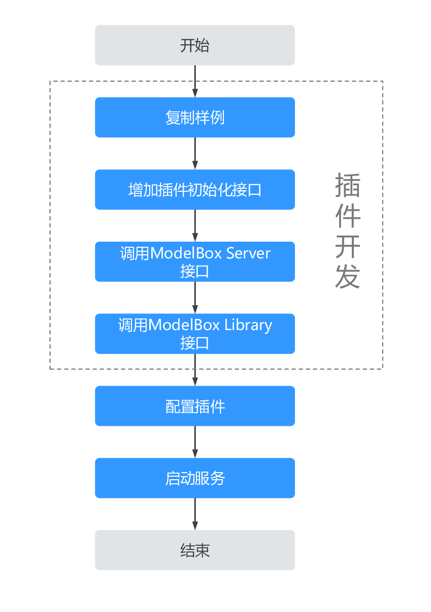

# ModelBox服务插件

## ModelBox服务插件介绍

### 什么是ModelBox服务插件

服务插件是指基于ModelBox框架对外交互的组件，它可以用来作为AI应用和周边系统对接的桥梁。ModelBox框架提供了服务插件管理和扩展开发能力，用户可以定制化开发属于自己业务的插件来对接第三方平台，ModelBox框架可以将其加载并运行。在服务插件内可以完成流程图的加载和运行、任务的创建和启停，统计数据的收集等。同时，ModelBox框架可以支持多个服务插件的加载。

### 服务插件使用场景

服务插件在视频场景使用较为普遍，典型使用场景为：视频分析任务需要从外部平台或者组件下发到ModelBox框架进行任务分析时，需要通过服务插件来接受外部的请求并转化为ModelBox框架里的分析任务进行业务分析。同时服务插件也可以实现统计信息的收集并发送给外部运维平台，实现与外部系统的对接。

ModelBox框架提供了预置的服务插件ModelBox Plugin，提供流程图的加载和运行, 见[运行流程图](../../../plugins/modelbox-plugin.md)章节。在大部分情况下，可以直接使用ModelBox Plugin完成相应的业务功能，当某些场景下，ModelBox Plugin功能无法满足要求时，需要自定义开发服务插件，下面介绍服务插件的具体开发流程。

## 服务插件开发流程

服务插件开发整体流程如下：



## 服务插件API


ModelBox API按照类型包含：

### Plugin: 插件创建和启停等重载接口，此接口需要由用户实现

| 接口          | 接口功能                                                   | 说明                                                                     |
| ------------- | ---------------------------------------------------------- | ------------------------------------------------------------------------ |
| CreatePlugin  | 用户创建服务插件对象，并返回给ModelBox框架                 | ModelBox框架启动时加载参加时调用                                         |
| Plugin::Init  | 用户实现服务插件初始化逻辑，提供系统配置，插件初始化时调用 | ModelBox框架启动时，在CreatePlugin成功后插件初始化调用；不能存在阻塞操作 |
| Plugin::Start | 用户实现服务插件启动逻辑，插件启动时调用                   | 插件启动时调用                                                           |
| Plugin::Stop  | 用户实现服务插件停止逻辑，插件停止时调用                   | ModelBox框架进程退出时插件停止时调用                                     |

### Job： 任务管理组件

任务管理组件提供任务的添加，删除，查询。ModelBox框架任务管理存在以下几种对象概念：

- Job：算法服务层面的任务，一个Job加载一个流程图。
- JobManager：Job的管理，可以创建Job对象。
- Task：处理数据源层面的作业，一个Task即对应一次数据分析，可以是一路视频流的分析，也可以是一个视频文件的分析。Task可以实现数据输入到流程图(需要配合Input节点使用)，也可以实现配置参数传递到功能单元。
- TaskManager：Task的管理，可以创建Task对象。
- OneShotTask: 继承自Task，一次task，专指只有一次数据输入到流程图的场景，比如输入为一路视频流的地址，只会有一次数据传递给流程图，而后需要等待分析结果。所以OneShotTask还提供了task状态变化的回调注册接口。
- Session：会话信息，一个Task对应存在一个Session，Session中的数据可以在不同功能单元共享访问。

具体接口如下表：

| 接口                                | 接口功能                                    | 说明                                                           |
| ----------------------------------- | ------------------------------------------- | -------------------------------------------------------------- |
| JobManager::CreateJob               | 创建Job                                     |                                                                |
| JobManager::DeleteJob               | 删除Job                                     |                                                                |
| JobManager::GetJob                  | 获取某个Job对象                             |                                                                |
| JobManager::GetJobList              | 获取全部Job对象列表                         |                                                                |
| JobManager::QueryJobStatus          | 查询某个Job状态                             |                                                                |
| JobManager::GetJobErrorMsg          | 获取某个异常Job的错误信息                   |                                                                |
| Job::Init                           | 初始化Job对象                               |                                                                |
| Job::Build                          | Job对象资源申请                             |                                                                |
| Job::Run                            | 运行Job对象                                 |                                                                |
| Job::Stop                           | 停止Job对象                                 |                                                                |
| Job::GetJobStatus                   | 获取某个Job状态                             |                                                                |
| Job::CreateTaskManger               | 创建TaskManger                              |                                                                |
| TaskManager::Start                  | 启动TaskManager                             |                                                                |
| TaskManager::Stop                   | 停止TaskManager                             |                                                                |
| TaskManager::CreateTask             | 创建Task                                    |                                                                |
| TaskManager::DeleteTaskById         | 删除某个Task                                |                                                                |
| TaskManager::GetTaskById            | 获取某个Task对象                            |                                                                |
| TaskManager::GetTaskCount           | 获取Task个数                                |                                                                |
| TaskManager::GetAllTasks            | 获取所有Task对象                            |                                                                |
| TaskManager::SetTaskNumLimit        | 设置同时并发的Task最大个数                  | 超过设置最大个数时，ModelBox内部会排队处理                     |
| Task::Start                         | 启动Task                                    |                                                                |
| Task::Stop                          | 停止Task                                    |                                                                |
| Task::GetUUID                       | 获取Task id                                 |                                                                |
| Task::CreateBufferList              | 创建输入的buffer数据对象                    |                                                                |
| Task::GetLastError                  | 获取Task错误信息                            |                                                                |
| Task::GetTaskStatus                 | 获取Task状态                                |                                                                |
| Task::GetSessionConfig              | 获取Session配置对象                         | 获取配置对象后可以通过设置自定义参数，传递给需要的功能单元读取 |
| OneShotTask::FillData               | 发送数据指流程图                            |                                                                |
| OneShotTask::RegisterStatusCallback | 注册任务状态回调函数,任务结束或异常时会调用 |                                                                |  |

### Config： 配置对象

配置对象提供从服务配置文件中获取配置信息

### Listener：http/https监听组件

Listener监听组件可以注册http服务，监听相关的URI

### Timer： 定时器组件

定时器组件可以用于启动定时任务

## 开发例子

### 准备工作

插件开发前，请确保：

1. ModelBox Server正确安装并运行。
1. ModelBox Server Develop安装包正确安装。

### 创建服务插件模板

开发者可以通过modelbox-tool命名进行服务插件模板工程的创建，创建命令如下：

```shell
modelbox-tool template -service-plugin -name PluginName
```

### 编写插件入口函数

#### 插件入口流程

```c++
#ifndef MODELBOX_MODELBOX_EXAMPLE_PLUGIN_H_
#define MODELBOX_MODELBOX_EXAMPLE_PLUGIN_H_

#include "modelbox/server/plugin.h"
#include <memory>

// 插件需要实现的接口
class ModelBoxExamplePlugin : public Plugin {
 public:
  ModelBoxExamplePlugin(){};
  ~ModelBoxExamplePlugin(){};

  // 插件初始化时调用。
  bool Init(std::shared_ptr<modelbox::Configuration> config) override;
  // 插件开工启动时调用，非阻塞。
  bool Start() override;
  // 插件停止时调用。
  bool Stop() override;
};

// 插件创建接口
extern "C" {
std::shared_ptr<Plugin> CreatePlugin() {
    return std::make_shared<ModelBoxExamplePlugin>();
};
}
```

ModelBox加载服务插件流程如下：

1. ModelBox Server先调用插件中的`CreatePlugin`函数创建插件对象。

    插件需要在此函数中，创建插件对象，返回智能指针。

1. 再调用`Plugin::Init()`初始化插件，入参为TOML文件配置。

    插件可在初始化函数中，获取配置，并调用插件自身的初始化功能。

1. 再调用`Plugin::Start()`启动插件。

    插件在Start函数中启动插件服务，申请相关的资源；此函数不能阻塞。

1. 进程退出时，调用`Plugin::Stop()`停止插件功能。

    插件在Stop函数中停止插件的功能，并释放相关的资源。

1. 调用ModelBox Server，ModelBox Library相关接口。

    插件调用ModelBox Server，以及ModelBox Library的API进行业务控制和运行。具体参考相关的API。

#### Job创建流程

使用场景为流程图不依赖于外部给其输入，直接加载图配置即可运行场景。如图片推理服务，数据流可由流程图中的HTTP功能单元产生数据，再比如流程图中读本地文件作为数据源的场景。

  ```c++
   Job job_;
   JobManager job_manager_;

  bool ModelBoxExamplePlugin::Init(std::shared_ptr<modelbox::Configuration> config)
  {
     //创建JobManager
     job_manager_ = std::make_shared<JobManager>();
     //从配置文件获取图配置，config对象为运行时传入的conf配置文件，默认路径为/usr/local/etc/modelbox/modelbox.conf
     auto graph_path = config->GetString("server.flow_path");
     //创建Job
     job_ = job_manager_->CreateJob("my_job", graph_path);
     
     auto ret = job_->Init();
     return ret;
  }

  bool ModelBoxExamplePlugin::Start()
  {
     job_->Build();
     job_->Run();
     return true;
  }


  bool ModelBoxExamplePlugin::Stop()
  {
     auto ret = job_->Stop();
     ret = job_manager_->DeleteJob("my_job");
     return ret; 
  }

  ```

#### Task创建流程

使用场景为流程图运行依赖与外部输入的场景，如分析的视频流信息需要由外部传入服务插件，再用服务插件创建Task，并把相应配置参数数据传递到流程图。

```c++
  void ModelBoxExamplePlugin::ModelBoxTaskStatusCallback(modelbox::OneShotTask *task,
                                     modelbox::TaskStatus status) {
    //实现任务结束或者任务异常时处理逻辑
    return;
  }
  bool ModelBoxExamplePlugin::Start()
  {
      job_->Build();
      job_->Run();
      //创建task manager，携带最大并发数
      auto task_manager = job->CreateTaskManger(10);
      task_manager->start();
      
      //创建task
      auto task = task_manager->CreateTask(modelbox::TASK_ONESHOT);
      auto oneshot_task = std::dynamic_pointer_cast<OneShotTask>(task);
      //创建buff数据并发送给流程图        
      auto buff_list = oneshot_task->CreateBufferList();
      auto input_cfg = "{\"url\"：\"xxxx\"}";  //输入需要的配置信息，由流程图中输入节点决定
      auto status = buff_list->Build({input_cfg.size()});
      if (status != modelbox::STATUS_OK) {
          return status;
      }
      auto buff = buff_list->At(0);
      auto ret = memcpy_s(buff->MutableData(), buff->GetBytes(), input_cfg.data(),
                          input_cfg.size());
      buff->Set("source_type", std::string("url")); //输入需要的配置信息，由流程图中输入节点决定
      std::unordered_map<std::string, std::shared_ptr<BufferList>> datas;
      datas.emplace("input1", buff_list);//输入节点名称由流程图决定
      status = oneshot_task->FillData(datas);
      if (status != modelbox::STATUS_OK) {
          return status;
      }
      //填充用户自定义配置
      auto config = oneshot_task->GetSessionConfig();
      config->SetProperty("nodes.{key}", "{vaule}");//设置属性
      //注册Task状态变更回调函数
      oneshot_task->RegisterStatusCallback(
      [&](OneShotTask *task, TaskStatus status) {
          t->ModelBoxTaskStatusCallback(task, status);
          return;
      });
      
      status = oneshot_task->Start();
      if (status != modelbox::STATUS_OK) {
          return status;
      }
      //等待task执行结束
      auto task_status = iva_task->GetTaskStatus();
      while (task_status != TaskStatus::STOPPED &&
          task_status != TaskStatus::ABNORMAL && 
          task_status != TaskStatus::FINISHED) {
          sleep(1);
          task_status = iva_task->GetTaskStatus();
      }
      task_manager->DeleteTaskById(oneshot_task->GetTaskId());
      return true;
}
```

### 服务插件配置使用

插件开发完成后，编译为SO文件。需要将插件加入ModelBox Server配置文件的`plugin.files`配置项插件配置列表中，即默认路径为`/usr/local/etc/modelbox/modelbox.conf`的`plugin.files`配置项。

```toml
[plugin]
files = [
    "/usr/local/lib/modelbox-plugin.so",   #由于不同操作系统目录结构存在差异，此路径也可能为 /usr/local/lib64/modelbox-plugin.so
    "/xxx/xxx/example-plugin.so" 
]
```

配置说明：

1. modelbox-plugin.so为系统预置插件，可根据需要添加
1. 插件按从上到下的顺序加载。
1. 若采用tar.gz包安装的服务，modelbox.conf配置文件在对应的服务目录中。
1. 开发者可扩展增加toml的配置项，在ModelBoxExamplePlugin::Init接口的configuration对象中获取即可。

插件加入配置文件后，`systemctl restart modelbox`重启ModelBox Server生效， 同时服务插件日志将统一收集到ModelBox日志。
